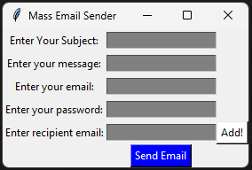

# 📧 Mass Email Sender

A simple yet effective desktop application built with **Python** and **Tkinter** that enables you to send **personalized emails to multiple recipients** with just a few clicks.

Developed as part of a first-semester academic project, this tool demonstrates essential programming concepts such as **file handling**, **GUI design**, and **email automation**.

---

## 📝 Description

This application features a **user-friendly graphical interface** that allows you to:

- 📬 Compose an email with a custom subject and message  
- 📁 Add multiple recipient email addresses to a local file (`recipients.txt`)  
- 📤 Send emails to all listed recipients via your Gmail account  
- 🖥️ Receive real-time desktop notifications after each successful email dispatch  

This is a great tool for sending bulk messages like **newsletters**, **announcements**, or **event invitations**.

---

## ✨ Features

- ✅ **Graphical User Interface**: Built with Tkinter for intuitive usability  
- 📤 **Bulk Email Support**: Send emails to multiple recipients listed in `recipients.txt`  
- ➕ **Dynamic Recipient Management**: Add new recipients directly through the interface  
- 🔐 **Secure Emailing**: Uses `smtplib` with `starttls()` to establish a secure connection to Gmail’s SMTP server  
- 🔒 **Password Masking**: Hides password input for better security  
- 🖥️ **Desktop Notifications**: Uses the `plyer` library to confirm successful sends in real-time  
- ✍️ **Custom Subject & Body**: Personalize your message with a subject and body content  

---

## 🖼️ Screenshot



## ⚙️ Requirements

Ensure the following dependencies are installed before running the script:

- Python 3.x  
- Tkinter (usually pre-installed)  
- `smtplib` (Python standard library)  
- `plyer` (for desktop notifications)  

Install `plyer` using pip:

```bash
pip install plyer
```

---

## 🚀 How to Use

### 1. Clone the Repository

```bash
git clone https://github.com/your-username/mass-email-sender.git
cd mass-email-sender
```

### 2. Run the Script

```bash
python your_script_name.py
```

### 3. Add Recipient Emails

- Enter an email in the **"Enter recipient email"** field  
- Click **"Add!"** to save it to `recipients.txt`  
- Repeat for each recipient  

> ⚠️ **Note:** The file `recipients.txt` is **overwritten** each time the app starts (due to `"w"` mode). To preserve recipients, modify the code to use **append mode** (`"a"`) or pre-populate the file manually.

### 4. Compose and Send

- Fill in your **Subject** and **Message**  
- Provide your **Gmail Email** and **Password**  
- Click **"Send Email"** to send messages  

You'll receive a desktop notification for each successful email sent.

---

## ⚠️ Important Notes

- **Gmail Security:** You may need to enable **"Allow less secure apps"** in your Google Account settings *(no longer supported for most accounts)*  
- 🔐 **Recommended:** Use a **Google App Password** instead of your main password. Learn more from [Google's App Password Help Page](https://support.google.com/accounts/answer/185833)

### 🔧 Error Handling Limitations

This basic version does not handle:

- Invalid email addresses  
- Network or connection errors  
- Incorrect login credentials  

You can improve the script by adding try/except blocks and input validation.

---

## 📚 References

- [GeeksforGeeks](https://www.geeksforgeeks.org/) — for programming tutorials  
- [PyPI - plyer](https://pypi.org/project/plyer/) — for desktop notifications  

---

## 📌 Final Thoughts

This **Mass Email Sender** is a great entry-level project for learning about:

- GUI development with **Tkinter**  
- Email automation using **smtplib**  
- File I/O operations  
- Python libraries like `plyer`  

You're encouraged to enhance it further by adding:

- HTML email support  
- Email attachments  
- Better error handling  
- CSV import for recipients  
- Sending progress bar

---

> Made with ❤️ using Python and Tkinter  
